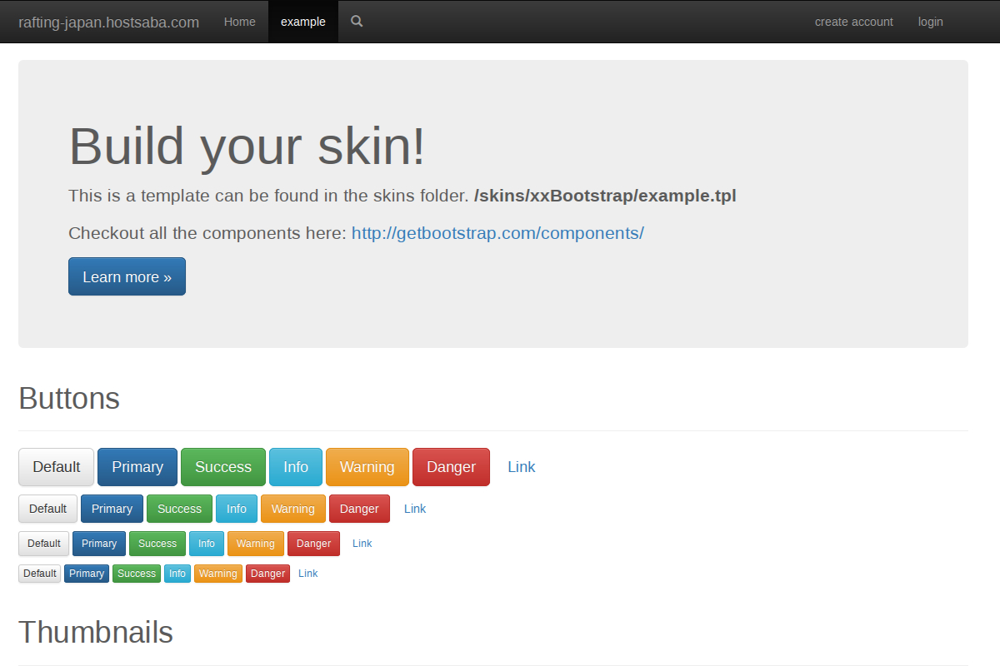
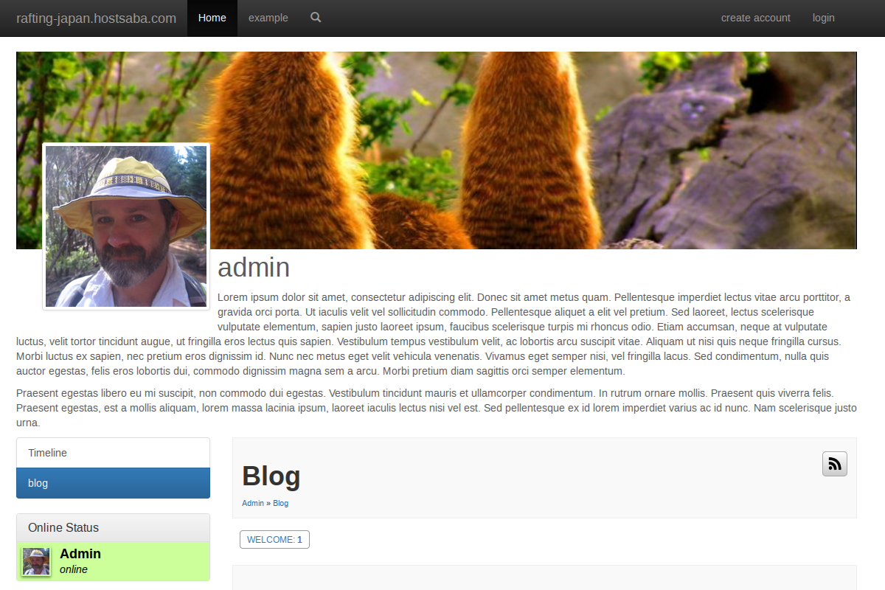
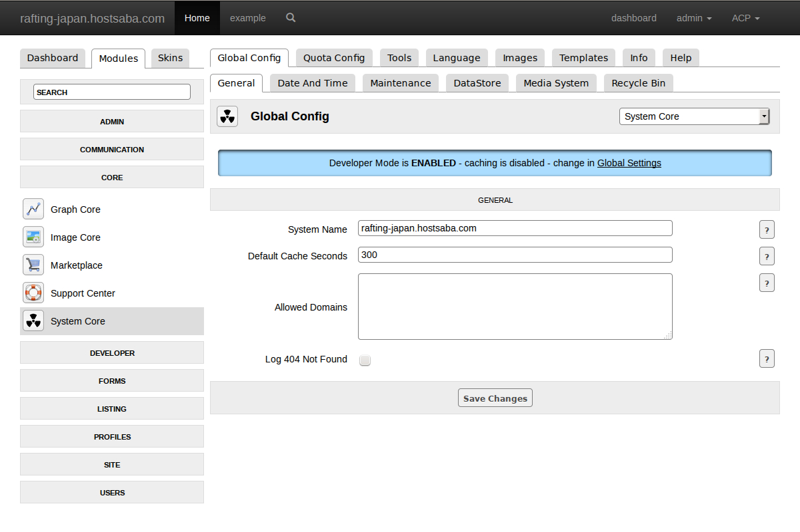

Bootstrap 3.3.6 skin for Jamroom 5
=========

This is a base blank skin for building Jamroom 5 skins on top of.

JR5-bootstrap

Feel free to use this code in any way you like.

License
------------
Skins built on top of this base can be released into the Jamroom marketplace (https://www.jamroom.net/download) under either a free or a commercial license.

Twitter Bootstrap Copyright and license: Code and documentation copyright 2011-2014 Twitter, Inc. Code released under [the MIT license](LICENSE). Docs released under [Creative Commons](docs/LICENSE).

Twitter Bootstrap Authors:
**Mark Otto**: <http://twitter.com/mdo> <http://github.com/mdo>
**Jacob Thornton**: <http://twitter.com/fat> <http://github.com/fat>

Collaboration
-------------

IRC discussion on open source Jamroom matters can be found on freenode in the #jamroom channel.

Screenshots
-----------

### screenshot of the front end

### screenshot of the profiles section

### screenshot of the admin section

